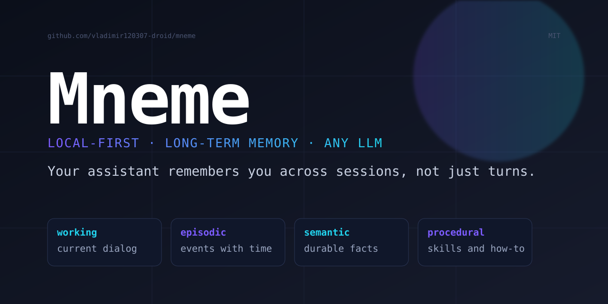

<p align="center">
  
</p>

<h1 align="center">Mneme</h1>

<p align="center">
  <strong>Local-first AI agent with human-like long-term memory.</strong><br/>
  Your assistant remembers you across weeks and months — not just one session.
</p>

<p align="center">
  <a href="https://github.com/vladimir120307-droid/mneme/actions/workflows/test.yml"></a>
  <a href="LICENSE"></a>
  <a href="https://www.python.org/"></a>
  <a href="https://github.com/vladimir120307-droid/mneme/stargazers"></a>
  <a href="https://github.com/vladimir120307-droid/mneme/network/members"></a>
  <br/>
  <a href="https://github.com/vladimir120307-droid/mneme/issues"></a>
  <a href="https://github.com/vladimir120307-droid/mneme/pulls"></a>
  <a href="https://github.com/vladimir120307-droid/mneme/commits/master"></a>
  <a href="README.ru.md"></a>
</p>

<p align="center">
  <a href="docs/quickstart.md">Quickstart</a> ·
  <a href="docs/memory-model.md">Memory model</a> ·
  <a href="docs/architecture.md">Architecture</a> ·
  <a href="docs/api.md">API</a> ·
  <a href="docs/benchmarks.md">Benchmarks</a> ·
  <a href="README.ru.md">🇷🇺&nbsp;Русский</a>
</p>

---

Every modern chatbot loses its mind the moment a session ends. Mneme is a
small open-source layer that sits between you and any large language model and
gives it a real memory: four kinds of it, modelled after how the human brain
holds on to things — *working*, *episodic*, *semantic*, and *procedural*.
Plug it into Ollama for fully local inference, or point it at OpenAI, Anthropic,
OpenRouter, LM Studio, vLLM — anything OpenAI-compatible.

```
   ┌──────────────┐    ┌────────────────────┐    ┌──────────────┐
   │  your input  │ →  │  Mneme: retrieve   │ →  │   any LLM    │
   └──────────────┘    │  → answer → store  │    └──────────────┘
                       └────────────────────┘
                                  │
                                  ▼
                        ┌──────────────────┐
                        │  durable memory  │
                        │  (4 types)       │
                        └──────────────────┘
```

## Why Mneme

| Problem | Mneme |
|---|---|
| Chatbots forget across sessions | Persistent memory survives restarts and reboots |
| Vector dumps return junk | Four memory kinds with different retention & retrieval rules |
| Cloud-only memory tools | Local-first; runs offline against Ollama or llama.cpp |
| Library-only (Letta / Mem0) | Library **plus** CLI **plus** OpenAI-compatible REST |
| Provider lock-in | One config swap moves you between any LLM backends |

## Install

```bash
pip install mneme
# faster vector search on large stores (optional, needs C/C++ toolchain):
pip install "mneme[fast]"
# from source
git clone https://github.com/vladimir120307-droid/mneme
cd mneme && pip install -e ".[dev]"
```

## 60-second quick start

### 1. CLI chat (local-first)

```bash
ollama pull llama3.1
mneme chat --provider ollama --model llama3.1
```

Tell it your name on Monday. Come back on Friday — it still knows.

### 2. Python

```python
import asyncio
from mneme import Agent
from mneme.agent import AgentConfig

async def main():
    agent = Agent(AgentConfig(provider="ollama", model="llama3.1"))
    agent.remember("I live in Berlin and write Rust.", importance=0.9)
    print(await agent.chat("Where do I live and what do I code in?"))
    agent.close()

asyncio.run(main())
```

### 3. REST (OpenAI-compatible)

```bash
mneme serve --port 8077
```

```bash
curl http://localhost:8077/v1/chat/completions \
  -H "Content-Type: application/json" \
  -d '{"messages":[{"role":"user","content":"hello"}]}'
```

Any tool that speaks the OpenAI API — `openai` SDK, LangChain, your own
client — just point `base_url` at `http://localhost:8077/v1`.

## The four kinds of memory

| Kind | Lifetime | What it holds |
|---|---|---|
| **Working** | minutes | The current conversation window |
| **Episodic** | days–weeks | Specific events with timestamps |
| **Semantic** | indefinite | Distilled facts ("user lives in Berlin") |
| **Procedural** | indefinite | Skills and how-to sequences |

A background **consolidator** turns repeated episodic experiences into
semantic facts, and low-value old episodes decay away on a half-life. Full
spec: [`docs/memory-model.md`](docs/memory-model.md).

## Configuration

Everything is overridable by env vars or CLI flags.

| Env var | Default | Purpose |
|---|---|---|
| `MNEME_PROVIDER` | `ollama` | `ollama` · `openai` · `anthropic` · `openrouter` · `lmstudio` · `vllm` |
| `MNEME_MODEL` | `llama3.1` | Model name on the chosen provider |
| `MNEME_DATA_DIR` | OS user-data dir | Where the SQLite + HNSW files live |
| `MNEME_EMBEDDING_MODEL` | `sentence-transformers/all-MiniLM-L6-v2` | Embedding model |
| `MNEME_HOST` / `MNEME_PORT` | `127.0.0.1:8077` | REST server bind |

## CLI reference

```
mneme chat                    interactive REPL with streaming
mneme ask "question..."       one-shot
mneme serve                   start the REST server
mneme remember "fact..."      add an episodic memory
mneme memory list             list memories
mneme memory search "..."     hybrid vector + recency + importance search
mneme memory stats            counts by kind
mneme memory forget <id>      delete (id prefix accepted)
mneme memory decay            prune low-value old memories
```

## Architecture

```
src/mneme/
├── agent.py              top-level Agent
├── consolidation.py      episodic → semantic
├── config.py             env-based settings
├── memory/
│   ├── types.py          pydantic models
│   ├── store.py          SQLite + vector index
│   ├── index.py          numpy / hnswlib backends
│   ├── embeddings.py     sentence-transformers
│   └── retrieval.py      hybrid scoring + context block
├── providers/
│   ├── ollama.py
│   ├── openai_compat.py
│   ├── anthropic.py
│   └── registry.py
├── api/server.py         FastAPI REST (OpenAI-compatible)
└── cli.py                Typer
```

## Performance

Single-threaded brute force on the pure-Python (numpy) backend, dim=384,
k=10, on a developer laptop:

| N (vectors) | search (mean) | QPS | add (100k batch) |
|---:|---:|---:|---:|
| 10 000 | 0.21 ms | 4 860 | — |
| 50 000 | 1.64 ms | 609 | — |
| 100 000 | 3.20 ms | 312 | 183 ms |

The hybrid scoring kernel is vectorised; with the native C++ backend
present it dispatches to a SIMD + OpenMP implementation transparently.
Reproduce: `python benchmarks/vector_search.py`. Full numbers in
[`docs/benchmarks.md`](docs/benchmarks.md) ([RU](docs/benchmarks.ru.md)).

## Native acceleration (optional)

A C++17 core (`native/`, header-only-friendly, OpenMP-parallel, auto-vectorised
with AVX2) is available as a drop-in faster backend. Build it once and
Mneme picks it up automatically:

```bash
python -m mneme.build_native
```

See [`native/README.md`](native/README.md) for details. Without it the pure
Python path is used — everything still works.

## Roadmap

- [x] Working / Episodic / Semantic / Procedural memory split
- [x] Hybrid retrieval (similarity + recency + importance + access)
- [x] OpenAI-compatible REST server
- [x] Ollama / OpenAI / Anthropic / OpenRouter / LM Studio / vLLM providers
- [x] Native C++ memory core (drop-in faster backend)
- [ ] Tool use and structured function calling
- [ ] Multi-user sessions and per-user namespacing
- [ ] Cross-platform desktop UI (Flutter)
- [ ] Browser extension
- [ ] Memory import from Markdown, journals, chat exports

## Documentation

| Topic | English | Русский |
|---|---|---|
| Quickstart | [docs/quickstart.md](docs/quickstart.md) | [docs/quickstart.ru.md](docs/quickstart.ru.md) |
| Memory model | [docs/memory-model.md](docs/memory-model.md) | [docs/memory-model.ru.md](docs/memory-model.ru.md) |
| Architecture | [docs/architecture.md](docs/architecture.md) | [docs/architecture.ru.md](docs/architecture.ru.md) |
| Configuration | [docs/configuration.md](docs/configuration.md) | [docs/configuration.ru.md](docs/configuration.ru.md) |
| API reference | [docs/api.md](docs/api.md) | [docs/api.ru.md](docs/api.ru.md) |
| Benchmarks | [docs/benchmarks.md](docs/benchmarks.md) | [docs/benchmarks.ru.md](docs/benchmarks.ru.md) |

## Contributing

Issues and PRs welcome. Run the test suite:

```bash
pip install -e ".[dev]"
pytest
ruff check src/ tests/ benchmarks/
```

## License

MIT — see [LICENSE](LICENSE).
